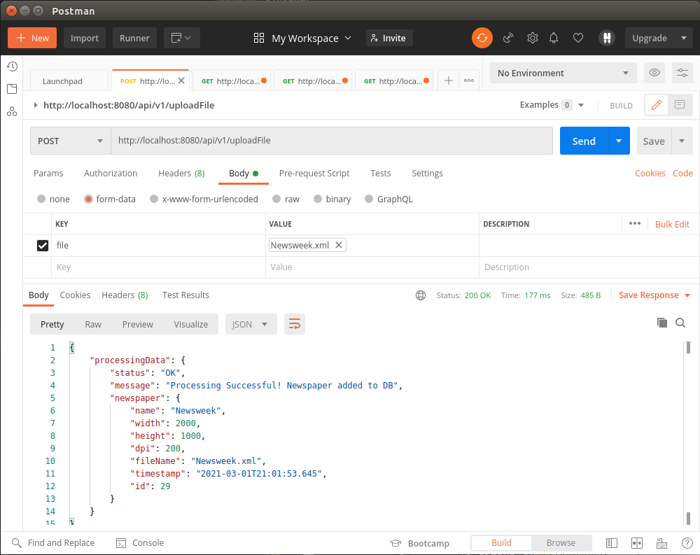
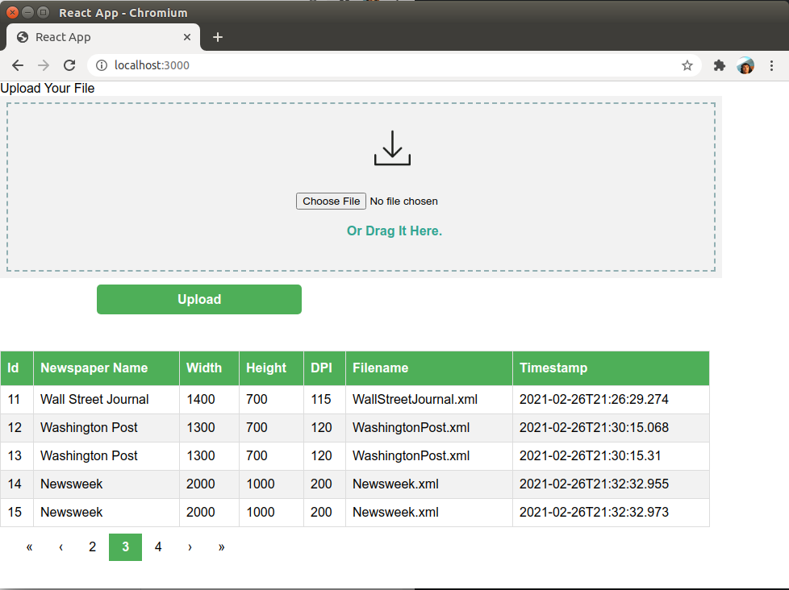

# Seb demo application

This application should receive xml file and present stored details.

Solution is based on endpoints:

-to upload file

-to retrieve filtered results (sorting, pagination, filters)


## User manual:

First of all: database is needed, there are **3** separate scenarios to prepare database:

### (1) Empty database
docker-composer will create it, indices will start from 1

go to project folder:

```
$ docker-compose up -d
```

To check it connection as root:
```
$ docker exec -it mysql57dc mysql -uroot -p
```
password is `mypassword`

Or check telnet:
```
$ telnet localhost 3306
```

### (2) Database from file provided by zip:
Docker container will use storage provided `mysql_data.zip`

unzip file where you like it, but update path in `docker-compose-path.yml`

now it is in configuration : 

`/opt/docker/volumes/mysql_data`

When running docker it will utilize database files created earlier.

```
$ docker-compose -f docker-compose-path.yml up -d
```

Root access is also possible directly from host machine:
```
mysql -h127.0.0.1 -uroot -p newspaper_data
```

### (3) Database populated by db dump
Start composer
```
$ docker-compose up -d
$ docker exec -i mysql57dc mysql -uroot -pmypassword newspaper_data <  2021-03-01_newspaper_db_backup.sql
```
---

### Run java app service:

```
$ java -jar demo-app-1.0-SNAPSHOT.jar
```

API calls:

Retrieve results:
```
curl http://localhost:8080/api/v1/newspaper/findAllWithFilters
```

If database is down:
```
{
    "error": "Unable to acquire JDBC Connection; nested exception is org.hibernate.exception.JDBCConnectionException: Unable to acquire JDBC Connection"
}
```
If is up and has data:
```
{
    "total": 28,
    "newspapers": [
        {
            "name": "abb",
            "width": 1280,
            "height": 752,
            "dpi": 160,
            "fileName": "Mock-filename",
            "timestamp": "2021-02-25T22:46:19.981",
            "id": 1
        },
...
        {
            "name": "Wall Street Journal",
            "width": 1400,
            "height": 700,
            "dpi": 115,
            "fileName": "WallStreetJournal.xml",
            "timestamp": "2021-02-26T21:26:29.082",
            "id": 10
        }
    ],
    "total_pages": 3,
    "current_page": 0,
    "page_size": 10
}
```
Pagination:
```
$ curl http://localhost:8080/api/v1/newspaper/findAllWithFilters?pageNo=0&pageSize=2
{
    "total": 28,
    "newspapers": [
        {
            "name": "abb",
            "width": 1280,
            "height": 752,
            "dpi": 160,
            "fileName": "Mock-filename",
            "timestamp": "2021-02-25T22:46:19.981",
            "id": 1
        },
        {
            "name": "abb",
            "width": 1280,
            "height": 752,
            "dpi": 160,
            "fileName": "Mock-filename",
            "timestamp": "2021-02-25T22:47:25.9",
            "id": 2
        }
    ],
    "total_pages": 14,
    "current_page": 0,
    "page_size": 2
}
```
Sorting:

(name, width, height, dpi, fileName)
```
$ curl http://localhost:8080/api/v1/newspaper/findAllWithFilters?sortBy=dpi
{
    "total": 28,
    "newspapers": [
        {
            "name": "Wall Street Journal",
            "width": 1400,
            "height": 700,
            "dpi": 115,
            "fileName": "WallStreetJournal.xml",
            "timestamp": "2021-02-26T21:26:29.082",
            "id": 10
        },
        {
            "name": "Wall Street Journal",
            "width": 1400,
            "height": 700,
            "dpi": 115,
            "fileName": "WallStreetJournal.xml",
            "timestamp": "2021-02-26T21:26:29.274",
            "id": 11
        },
...
        {
            "name": "USA Today",
            "width": 1500,
            "height": 800,
            "dpi": 130,
            "fileName": "USAToday.xml",
            "timestamp": "2021-02-27T16:27:05.129",
            "id": 20
        }
    ],
    "total_pages": 3,
    "current_page": 0,
    "page_size": 10
}
```

Filtering:

Keys can be combined or ommited (name, width, height, dpi, fileName)
```
$ curl http://localhost:8080/api/v1/newspaper/findAllWithFilters?name=Newsweek
...
$ curl http://localhost:8080/api/v1/newspaper/findAllWithFilters?dpi=120&height=700
{
    "total": 7,
    "newspapers": [
        {
            "name": "Los Angeles Times",
            "width": 900,
            "height": 700,
            "dpi": 120,
            "fileName": "LosAngelesTimes.xml",
            "timestamp": "2021-02-26T20:35:54.76",
            "id": 5
        },
        {
            "name": "Washington Post",
            "width": 1300,
            "height": 700,
            "dpi": 120,
            "fileName": "WashingtonPost.xml",
            "timestamp": "2021-02-26T21:30:15.068",
            "id": 12
        },
...
    ],
    "total_pages": 1,
    "current_page": 0,
    "page_size": 7
}
```
Upload files with Postman:




Whole solution might be tested in browser:
```
http://localhost:8080
```
Clicking on headers you can change order of display.


---

## Developer manual

### Backend

Java application is usual spring boot project.

Sever works on localhost:8080

Starting from IDE or command line or `$ mvn spring-boot:run`

Integration tests are using H2 database, no need for docker setup.

### Frontend

requires npm, yarn

It will start on localhost:3000

```
$ cd frontend
$ npm install
$ yarn start
```

### Production

```
$ mvn package
$ java -jar target/demo-app-1.0-SNAPSHOT.jar
```
Both frontend and backend will be on same port 8080


## Making of (if needed for reference)


### Subtasks progress

Tasks:

- [x] Spring boot initialize with maven

- [x] Create rest endpoint that is accepting file

- [x] Validate and parse XML base on XSD

- [x] Insert data to database

- [x] Create endpoint that is getting data from database

- [x] Create gui that is allowing for pagination, sorting, filtering

- [x] Merge frontend with backend

- [x] Create docker database

- [x] Create user manual


### Spring boot initialize with maven
```
$ mvn archetype:generate -DgroupId=com.pearteam.demoapp -DartifactId=demo-app -DarchetypeArtifactId=maven-archetype-quickstart -DarchetypeVersion=1.4 -DinteractiveMode=false
```

Update configuration in __pom.xml__ for sprint boot

Check if DemoApp.java is working as package

```
$ mvn package
$ java -jar target/demo-app-1.0-SNAPSHOT.jar
```

Confirm:

[local link](http://localhost:8080/)


### create docker database

[docker my sql example](https://phoenixnap.com/kb/mysql-docker-container)
[details](https://hub.docker.com/r/mysql/mysql-server/)
```
$ docker pull mysql/mysql-server:5.7
$ docker images
```

output:

```
REPOSITORY          TAG  IMAGE ID      CREATED      SIZE
mysql/mysql-server  5.7  d89be6fa036c  5 weeks ago  360MB
```

```
$ docker run -d -e MYSQL_ROOT_PASSWORD=mypassword -p 3306:3306 --name mysql57 mysql/mysql-server:5.7
$ docker ps

$ docker inspect mysql57
```
Search for something like this:
```
"IPAddress": "172.17.0.XX",
```

Check details (We can setup root password manually)

```
$ docker logs mysql57
```

And search for:

```
[Entrypoint] GENERATED ROOT PASSWORD: 20B4Hf3hvupOSXOD9uJ.0wJYz1
```
Execute:
```
$ docker exec -it mysql57 mysql -uroot -p
```

Put above password

Changing password command:

```
mysql> ALTER USER 'root'@'localhost' IDENTIFIED BY 'mypassword';
```

Check who have access

```
mysql> SELECT host FROM mysql.user WHERE User = 'root';
mysql> SELECT user, host FROM mysql.user;
```

Add access to root from host 172.17.0.1

```
mysql> CREATE USER 'root'@'172.17.0.1' IDENTIFIED BY 'mypassword';
mysql> GRANT ALL PRIVILEGES ON *.* TO 'root'@'172.17.0.1';
```

Add access to root from everywhere:

```
mysql> CREATE USER 'root'@'%' IDENTIFIED BY 'mypassword';
mysql> GRANT ALL PRIVILEGES ON *.* TO 'root'@'%';
```
Reload:
```
mysql> FLUSH PRIVILEGES;
```

Restart to gain port forwarding
```
$ docker run -d -e MYSQL_ROOT_PASSWORD=mypassword -p 3306:3306 --name mysql57 mysql/mysql-server:5.7
```
Check on computer
```
$ mysql -h127.0.0.1 -uroot -p
```

Create database, add spring user:
```
mysql> create database newspaper_data;
mysql> create user 'springuser'@'%' identified by 'ThePassword';
mysql> grant all on newspaper_data.* to 'springuser'@'%';
mysql> select * from newspaper_data.newspaper;
```
Setup access rights according to needs:
```
mysql> revoke all on db_example.* from 'springuser'@'%';

mysql> grant select, insert, delete, update on db_example.* to 'springuser'@'%';
```

### create docker with solution
[Export docker image](https://bobcares.com/blog/move-docker-container-to-another-host/)

```
$ docker-compose up -d

$ docker-compose down
```


## Improvements (known problems)

## Backend

- After adding file total count of records is not updated, temporary fix => reload page 

- Change parsing to use JAXB, it is more convenient

How to [here](https://www.baeldung.com/jaxb)

Details [oracle site](https://docs.oracle.com/javase/tutorial/jaxb/intro/examples.html)

- check / remove CORS workaround as now it works on one port

- add also logs

### Frontend

- add switch sorting asc / desc

- add filtering

- format timestamp

- fix components' positions


